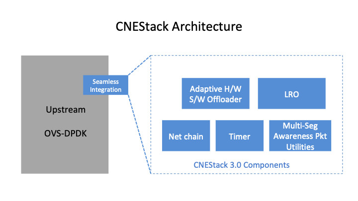
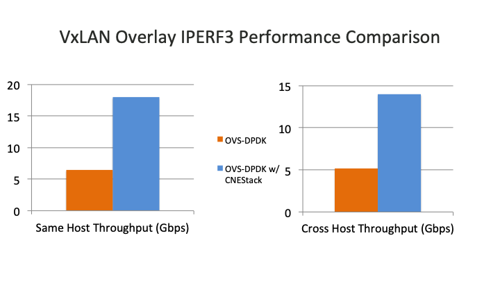

..
      Licensed under the Apache License, Version 2.0 (the "License"); you may
      not use this file except in compliance with the License. You may obtain
      a copy of the License at

          http://www.apache.org/licenses/LICENSE-2.0

      Unless required by applicable law or agreed to in writing, software
      distributed under the License is distributed on an "AS IS" BASIS, WITHOUT
      WARRANTIES OR CONDITIONS OF ANY KIND, either express or implied. See the
      License for the specific language governing permissions and limitations
      under the License.

      =======  Heading 0 (reserved for the title in a document)
      -------  Heading 1
      ~~~~~~~  Heading 2
      +++++++  Heading 3
      '''''''  Heading 4

      Avoid deeper levels because they do not render well.

============
CNEStack 3.0
============

  CNEStack is a software solution for accelerating virtual switches.
  It's derived from CloudNetEngine vSwitch release by modulizing the key
  techniques thus can be applied to other virtual switches,
  and it provides the best performance offloading solution in the industry.

Architecture
------------
  CNEStack has a flexible architecture to build various functionalities,
  and it can be easily and seamlessly integrated with upstream OVS-DPDK.

Offloading Key Features
-----------------------
  Hardware Software Adaptive VLAN/QinQ

  Hardware Software Adaptive L4 CKSUM

  Hardware Software Adaptive L4 CKSUM Over Tunnel

  Hardware Software Adaptive TSO

  Hardware Software Adaptive TSO Over Tunnel

  Hardware Software Adaptive Tunnel Outer UDP Checksum

  Software LRO

  Software UFO

  Software UFO over tunnel

Performance Comparison
----------------------
  The performance comparison is done by `open source CNE-OVS-SIT <https://github.com/cloudnetengine/cne-ovs-sit>`_,
  and OVS-DPDK source code is base on recent 2.16 branch.
  VXLAN virtual network Iperf performance is evaluated on two hosts connected by Intel XL710 40G links.

.. note::

   Upstream OVS-DPDK is long criticized for lack of overlay offload capabilities,
   ``userspace-tso-enable`` must be ``False`` for VXLAN deployment.

Evaluation
----------
  Welcome to evaluate CNEStack 3.0, please refer to `CNEStack 3.0 Evaluation Guide <https://github.com/cloudnetengine/cnestack-eval>`_.
